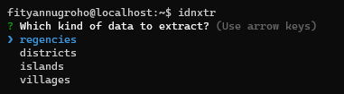

<h1>idn-area-extractor</h1>

Extract Indonesia area data from the raw sources to CSV.

This package was developed to ease and speed up the data processing stage of [idn-area-data](https://github.com/fityannugroho/idn-area-data).

## Prerequisite

- Node.js 18 or later
- npm 9 or later

## Installation

**idn-area-extractor** can be installed in the global scope (if you'd like to have it available and use it on the whole system) or locally for a specific package (especially if you'd like to use it programmatically):

Install globally:

```bash
npm install -g idn-area-extractor
```

Install locally:

```bash
npm install idn-area-extractor
```

## Usage

Access the manual with `idnxtr --help` command:

```
USAGE
  $ idnxtr [regencies|districts|islands|villages] </path/to/file.[pdf|txt]> [OPTIONS]

OPTIONS
  -c, --compare             Compare the extracted data with the latest data
  -d, --destination=<path>  Set the folder destination
  -o, --output=<filename>   Set a specific output file name without the file extension
  -r, --range=<range>       Extract specific PDF pages (e.g. 1-2,5,7-10)
  -R, --save-raw            Save the extracted raw data into .txt file (only works with PDF data)
      --silent              Disable all logs

EXAMPLE
  $ idnxtr
  $ idnxtr regencies ~/data/regencies.pdf
  $ idnxtr regencies ~/data/regencies.pdf -r 1-2,5,7-10 -R
  $ idnxtr regencies ~/data/regencies.pdf --range 1-2,5,7-10 --save-raw
  $ idnxtr regencies ~/data/raw-regencies.txt
```

### Interactive UI

Run `idnxtr` without arguments to launch the interactive UI that guides you to extracting the data.



## API

**idn-area-extractor** can be used programmatically by using the API documented below:

### `idnxtr(options)`

Extract the data from the PDF file.

#### `options`

**Required:**

- `options.data`: Which kind of data should be extracted, either 'regencies', 'districts', 'islands', or 'villages'.
- `options.filePath`: The path to the PDF or TXT file.

Optional:

- `options.compare`: Compare the extracted data with the latest data. Default: `false`.
- `options.destination`: The destination folder to save the CSV file. Default: `process.cwd()`.
- `options.output`: The output file name without the file extension. Default: `options.data`.
- `options.range`: Extract specific PDF pages (e.g. 1-2,5,7-10). If not set, all pages will extracted.
- `options.saveRaw`: Save the extracted raw data into .txt file (only works with PDF data). Default: `false`.
- `options.silent`: Disable all logs.  Default: `false`.

### Example

#### ESM

```js
// .js
import idnxtr from 'idn-area-extractor';

(async () => {
  await idnxtr({
    data: 'regencies',
    filePath: '/path/to/regencies.pdf',
    compare: true,
    destination: '/path/to/destination',
    output: 'regencies',
    range: '1-2,5,7-10',
    saveRaw: true,
    silent: true,
  });
})();
```

#### CommonJS

For **CommonJS** user, you need to use [dynamic import](https://developer.mozilla.org/en-US/docs/Web/JavaScript/Reference/Operators/import) like this:

```js
// .js
(async () => {
  const {default: idnxtr} = await import('idn-area-extractor')

  await idnxtr({
    // options...
  })
})()
```

## Problem Reporting

We have different channels for each problem, please use them by following these conditions :

### Reporting a Bug

To report a bug, please open a new issue following the [guide](CONTRIBUTING.md#submitting-an-issue).

### Requesting a New Feature

If you have a new feature in mind, please open a new issue following the [guide](CONTRIBUTING.md#submitting-an-issue).

### Asking a Question

If you have a question, you can search for answers in the [GitHub Discussions Q&A category](https://github.com/fityannugroho/idn-area-extractor/discussions/categories/q-a). If you don't find a relevant discussion already, you can open a new discussion.

## Support This Project

Give a ⭐️ if this project helped you!

You can support this project by donating via [GitHub Sponsor](https://github.com/sponsors/fityannugroho), [Trakteer](https://trakteer.id/fityannugroho/tip), or [Saweria](https://saweria.co/fityannugroho).
